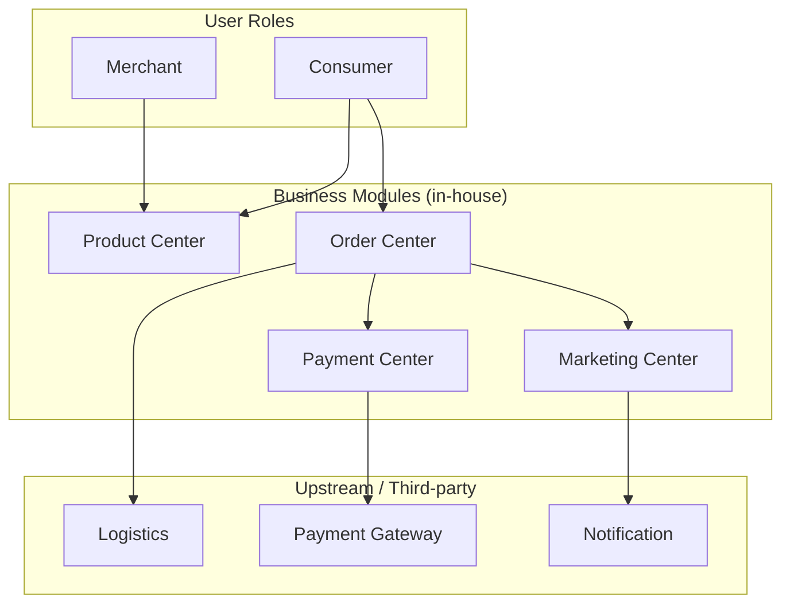
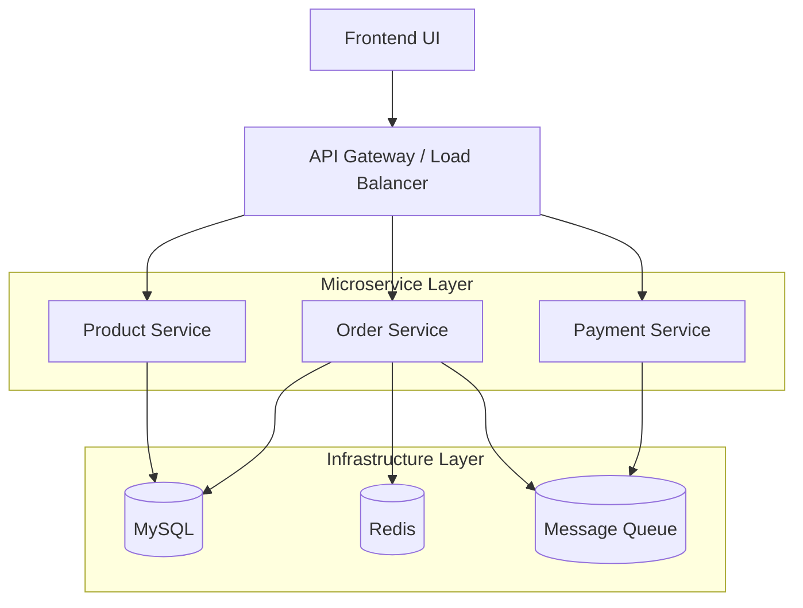
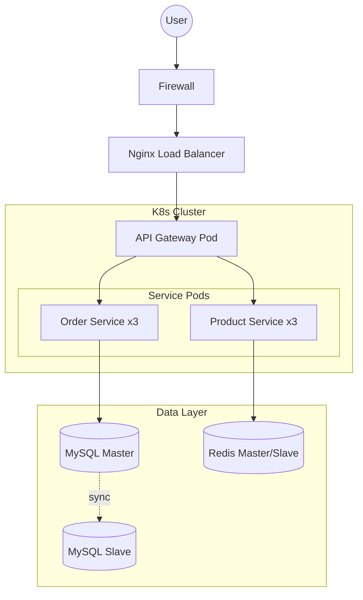
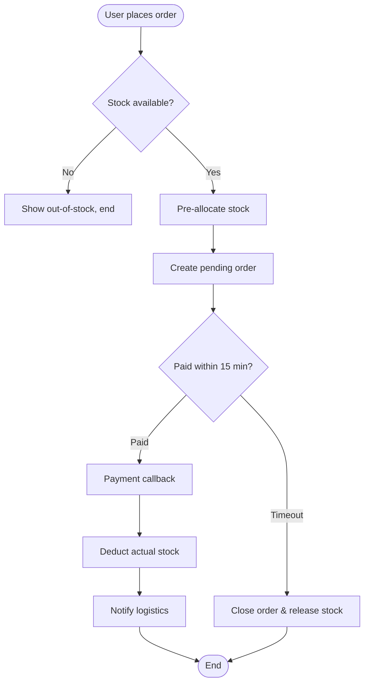
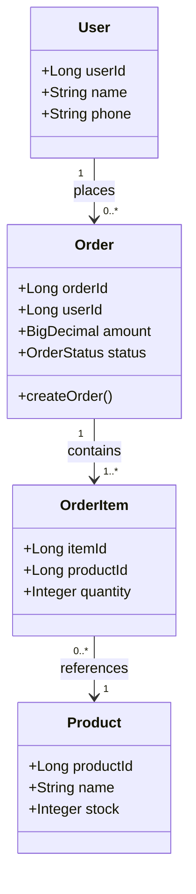
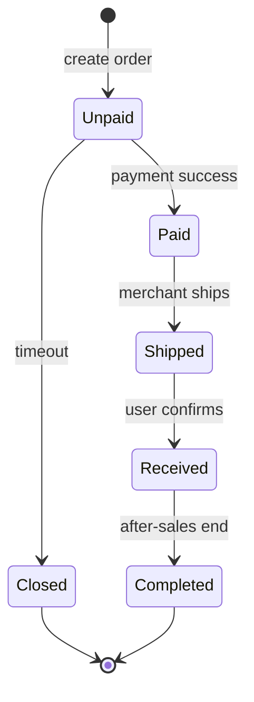
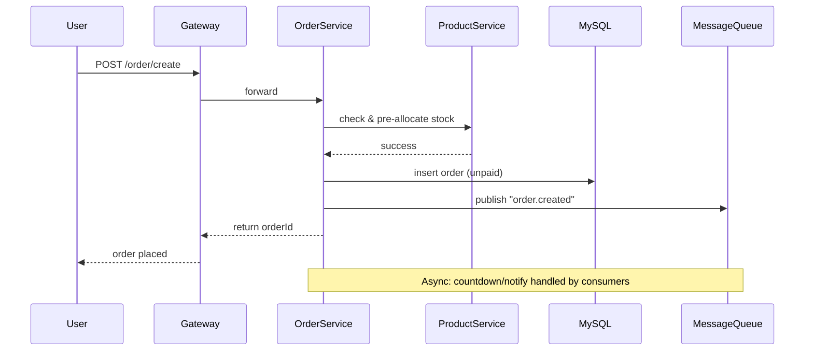
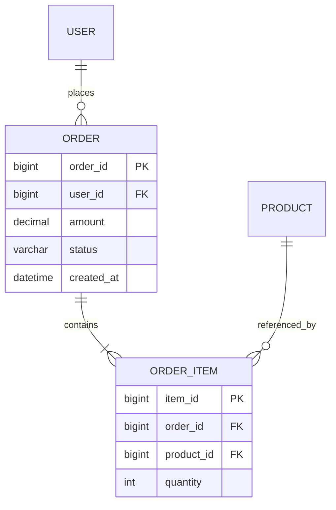

# Technical Design Document Skill

A skill for writing and reviewing backend technical design documents, distilled from industry best practices (Alibaba, ByteDance, etc. backend teams). Covers complete document structure, phased writing workflow, quantitative capacity formulas, and a review checklist.

## When to Invoke

Invoke this skill when:
- User needs to write a technical design document (design review / technical proposal)
- User mentions "技术方案", "方案设计", "设计评审", "技术设计文档", "design review"
- User is refactoring, building a new system, doing technical selection, or capacity planning
- User brings an existing technical proposal and needs it reviewed / audited
- User is doing a pre-launch design review

## Two Modes

Switch based on user intent:

- **Authoring Mode**: Guide the user through the workflow to produce a high-quality design doc
- **Review Mode**: Audit an existing proposal with the review checklist, output an issue list

---

## Core Principles (Apply Throughout)

| Principle | Meaning |
|-----------|---------|
| **Requirement-driven** | All design serves requirements; technology serves business |
| **Structured thinking** | Top-down, drill from user perspective down to code |
| **Option comparison** | Provide multiple alternatives, state trade-offs explicitly |
| **Exception-first** | Edge cases matter more than happy path (80% of incidents come from unhandled exceptions) |
| **Quantitative** | Performance, capacity, SLA must have numbers |
| **Rollback-ready** | Canary, rollback, disaster recovery are mandatory pre-launch questions |
| **Evolutionary** | Architecture evolves in phases; avoid over-engineering |

---

## Authoring Mode: Six-Step Workflow

### Step 1: Clarify Requirements & Background

**Goal**: Make the problem understandable to a non-expert.

**Guide user to clarify:**
1. Business background: project name, description, problem solved
2. Business pain points: concrete current problems
3. Glossary: terms and acronyms (do not introduce new undefined terms)
4. Requirement list (user perspective, not developer perspective):
   - Functional requirements
   - **Non-functional requirements** (often missed, critical): performance, availability SLA, observability, data volume

> Remind user: non-functional requirements are implicit business expectations that won't be spelled out. Considering them early identifies risk and improves robustness.

### Step 2: Architecture Three-View Design

**Goal**: Describe the system holistically, from abstract to concrete.

| View | Dimension | Question Answered |
|------|-----------|-------------------|
| **Business architecture** | Business modules | What functional modules? Upstream/downstream? Third-party/base service dependencies? |
| **Application architecture** | Microservices | How many services? Data flow (UI→gateway→service→infra)? |
| **Deployment architecture** | Physical | How is it deployed? Real topology of network, gateway, firewall, storage? |

**Reference Examples (E-commerce Order System, Mermaid syntax):**

**① Business Architecture** (business modules + upstream/downstream):


**② Application Architecture** (microservice vertical layering):


**③ Deployment Architecture** (physical topology):


**Diagram tips:**
- Color-code own modules vs. dependencies in business architecture
- Keep data flow direction consistent across all three views
- Architecture diagrams show structure; sequence diagrams show detail — don't mix them
- Mermaid tips: use `subgraph` for layering, `[( )]` for storage, `-. ->` for async/replication flows

### Step 3: Detailed Design

**Goal**: Make the architecture executable.

Includes:
- **End-to-end business flow**: global view
- **Domain entity design**: core classes, attributes, relationships (code abstraction, not DB tables)
- **State diagrams**: core entity state transitions (e.g., order: unpaid → paid → shipped)
- **Core sub-flow sequence diagrams**: service interactions for key scenarios (detailed enough to code against)
- **Storage design**: ER diagram + table schema
- **API design**: down to request/response params (can link to API portal)

**Reference Examples (E-commerce Order System, Mermaid syntax):**

**① End-to-End Business Flow** (order placement, flowchart):


**② Domain Entity Design** (classDiagram):


**③ State Diagram** (order lifecycle, stateDiagram-v2):


**④ Core Sequence Diagram** (create order, sequenceDiagram):


**⑤ Storage ER Diagram** (erDiagram):


> Tips: flowchart focuses on the core path and key branch decisions; sequence diagrams mark sync calls vs async messages; ER diagrams show only table relationships and key fields.

### Step 4: Option Comparison & Decision

**Goal**: Demonstrate depth of thinking, justify the decision.

- List 2~3 alternatives
- For each: summary (one-line highlight), details, performance target, **quantified** pros/cons
- **Comparison table**: performance, cost, complexity, maintainability
- **Explicit decision**: which do you prefer and why? **Trade-offs must be stated**

> Reviewers focus on trade-offs. Even without comparison, at least explain "why this option".

### Step 5: Stability & Capacity Assessment

**Goal**: Prove with numbers that the design handles the load, and ensure online stability.

**5.1 Exception & Edge Cases (Top Priority)**

Systematically enumerate (xmind-style recommended):
- Which modules and flows are involved?
- Handling strategy for each possible exception per flow?
- How are infrastructure-level failures (network jitter, disk full, downstream timeout) handled?

**5.2 High Availability**
- Module HA: multi-node ingress, inter-service timeout/retry/circuit-breaker, hot config reload, infra master-slave
- Third-party dependencies: list dependent APIs, strong/weak dependency type, fallback strategy

**5.3 Performance & Capacity (Quantitative Formulas)**

```
Daily avg requests: from product estimate
Avg QPS = daily avg requests ÷ 40000 seconds
  (86400s halved for active hours ≈ 40000s)
Peak QPS = avg QPS × (2~4x)
Required instances = peak QPS ÷ per-node QPS + redundancy
```

Output a resource estimate table: pod specs/count, MySQL, Redis.

### Step 6: Risk, Rollback & Roadmap

**Goal**: Safety net before launch + long-term direction.

- **Canary strategy**: how to roll out in batches
- **Rollback plan**: how to roll back on failure (data / code / config)
- **Disaster recovery**: how to handle IDC failure
- **Risk assessment**: change risks, incompatibilities, known issues
- **Phase roadmap**: how architecture evolves, per-phase goals
- **Effort estimate**: broken down to module/API, including dev + integration + test time

---

## Review Mode: Checklist

When user brings a proposal for review, check each item and output an issue list:

**Background & Requirements**
- [ ] Can a non-expert understand the background and problem?
- [ ] Is the glossary complete, with no undefined new terms?
- [ ] Are non-functional requirements covered (performance, availability, observability)?

**Architecture & Design**
- [ ] Are there business / application / deployment architecture diagrams?
- [ ] Is data flow consistent and color-coded across diagrams?
- [ ] Are there sequence diagrams for core flows, detailed enough to code?
- [ ] Is there storage design (ER + table schema)?
- [ ] Is API design down to request/response params?

**Depth**
- [ ] Are there option comparisons with quantified pros/cons?
- [ ] Are trade-offs and selection rationale explicit?
- [ ] Are key design decisions explained?

**Stability**
- [ ] Are edge cases systematically enumerated (not ad hoc)?
- [ ] Are third-party dependencies listed with strong/weak type and fallback?
- [ ] Does HA cover ingress, service, and infrastructure layers?

**Launch-readiness**
- [ ] Is there quantitative capacity assessment (QPS, resource counts)?
- [ ] Are there canary and rollback plans?
- [ ] Is there risk assessment and known-issues list?
- [ ] Is effort broken down to module/API with dev+integration+test time?

**Output format**: classify issues as Critical (blocks launch) / Important (should improve) / Suggestion (nice to have).

---

## Complete Document Template

```markdown
# [Project Name] Technical Design Document

> One line: what problem this design solves

| Field | Value |
|-------|-------|
| Author | |
| Date | |
| Reviewers | |

## 1. Background
### 1.1 Glossary
### 1.2 Business Background
### 1.3 Technical Background (only for legacy refactors)

## 2. Requirements & Goals
### 2.1 Business Requirements
### 2.2 Business Pain Points
### 2.3 Non-Functional Requirements
(performance / availability SLA / observability / data volume)

## 3. Architecture Design
### 3.1 Business Architecture
### 3.2 Application Architecture
### 3.3 Deployment Architecture

## 4. Detailed Design
### 4.1 End-to-End Business Flow
### 4.2 Domain Entity Design
### 4.3 State Diagrams
### 4.4 Core Sequence Diagrams
### 4.5 Storage Design (ER + schema)
### 4.6 API Design (request/response)

## 5. Option Comparison (optional)
### 5.1 Option A
### 5.2 Option B
### 5.3 Comparison & Decision (trade-offs)

## 6. High Availability Design
### 6.1 Module HA
### 6.2 Third-Party Dependencies & Fallback

## 7. Exception & Edge Cases (key)
(xmind-style systematic enumeration)

## 8. Performance & Capacity Assessment
(QPS formula + resource estimate table)

## 9. Risk, Rollback & Roadmap
### 9.1 Canary Strategy
### 9.2 Rollback Plan
### 9.3 Disaster Recovery
### 9.4 Risk Assessment
### 9.5 Phase Roadmap
### 9.6 Effort Estimate
```

> Trimming rule: new systems may skip "Technical Background"; simple changes may skip "Option Comparison"; but edge cases, capacity assessment, and rollback plans must never be omitted.

---

## Common Anti-Patterns (Focus During Review)

| Anti-pattern | Correct approach |
|--------------|------------------|
| Designing before understanding requirements | Write requirements (incl. non-functional) first |
| Giving conclusion without comparison | Provide 2~3 options, quantify, state trade-offs |
| Only happy path | Systematically enumerate edge cases |
| "Probably handles it" for performance | Quantify with QPS formula, give resource counts |
| No rollback plan | Explicit canary and rollback steps |
| Messy architecture diagrams | Three-view layering, semantic colors |
| Big-bang all at once | Phased evolution, each phase deliverable |
| Copying template without trimming | Add/remove modules per project reality |

---

## Key Principles Summary

1. **Edge cases are the dividing line** — the core gap between average and excellent designs
2. **Quantification is the baseline** — only docs with QPS, resource counts, SLA are engineering docs
3. **Trade-offs must be explicit** — the decision basis reviewers care about most
4. **Rollback is a launch prerequisite** — every design must answer "what if it fails"
5. **Methodology beats template** — templates can be trimmed, principles cannot

---

## Related Resources

- Methodology summary: technical-skills/best-practices/如何写好技术方案文档.md
- [Team technical design template](https://blog.51cto.com/u_15909947/5932075) (lite + detailed)
- [Backend design doc structure](https://blog.csdn.net/qq_42647903/article/details/138352011) (architecture three-view)
- *Distributed Service Architecture*, Ch.3 (capacity assessment)

---

*This skill provides systematic guidance for writing and reviewing technical design documents.*
