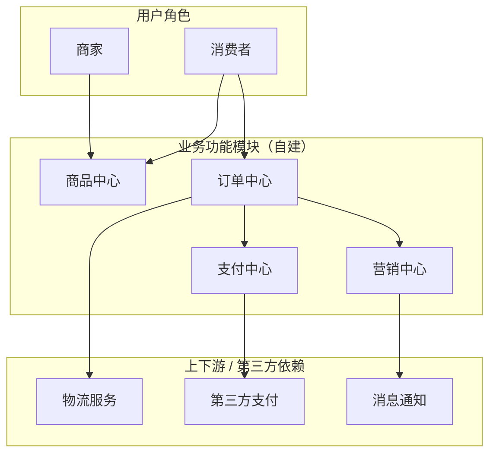
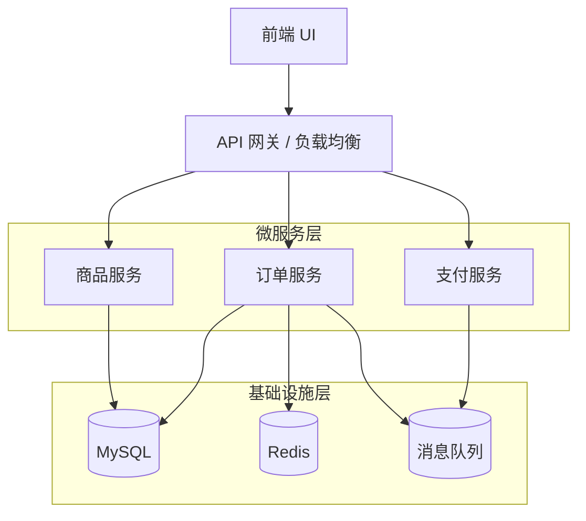
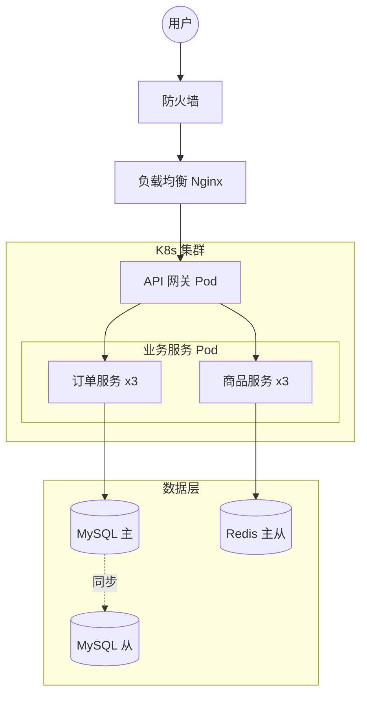
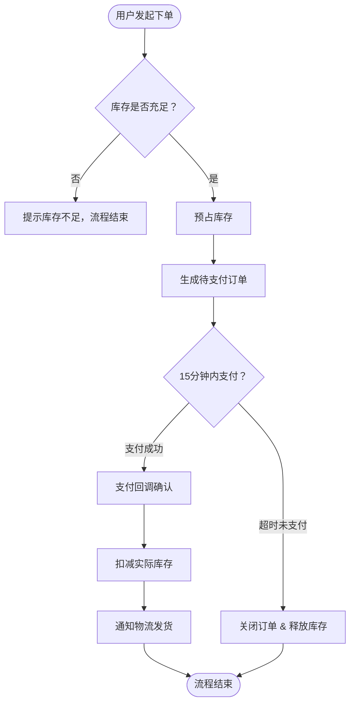
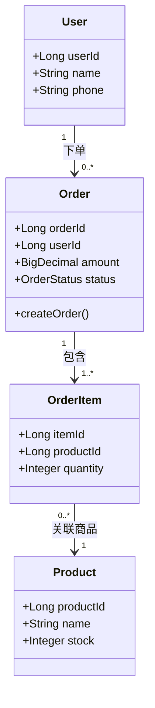
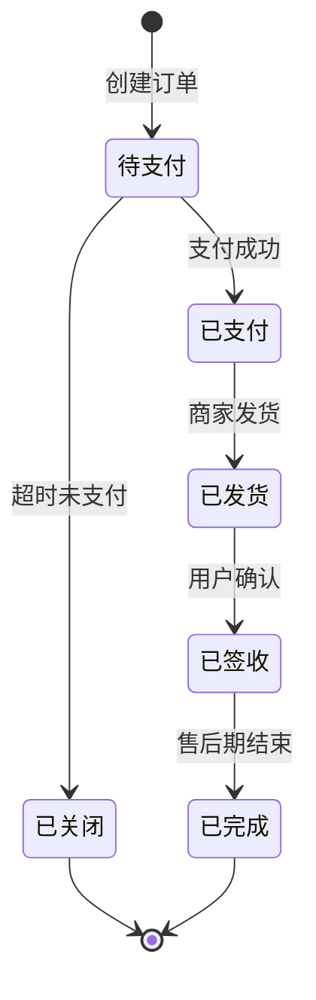
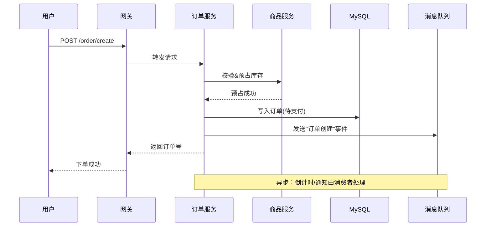
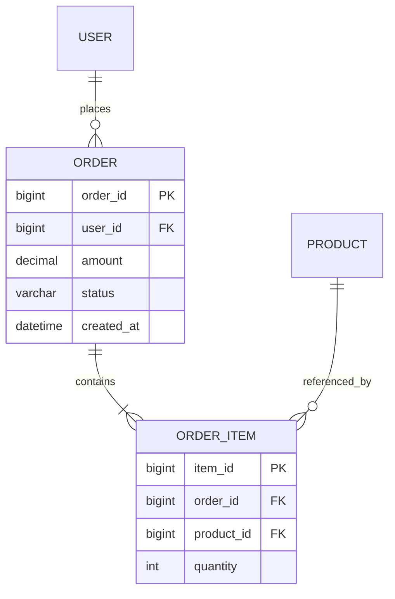

# 技术方案文档技能

基于业界（阿里、字节等大厂后端岗位）通用实践提炼的技术方案设计文档编写与审核技能。覆盖完整文档结构、分阶段编写流程、量化评估公式和评审清单。

## 调用时机

当出现以下情况时调用此技能：
- 用户需要编写技术方案设计文档（design review / 技术设计文档 / 方案设计）
- 用户提到"技术方案"、"方案设计"、"设计评审"、"技术设计文档"
- 用户要重构、新建系统、做技术选型、做容量评估
- 用户拿来一份技术方案，需要审核 / 评审 / 找问题
- 用户做上线前的方案 review

## 两种使用模式

本技能支持两种模式，根据用户意图切换：

- **编写模式**：引导用户按工作流产出一份高质量技术方案文档
- **审核模式**：用评审清单对已有方案做 review，输出问题清单和改进建议

---

## 核心原则（贯穿始终）

| 原则 | 含义 |
|------|------|
| **需求驱动** | 一切设计围绕需求，技术为业务服务 |
| **结构化思维** | 自上而下，从用户视角逐层下钻到代码 |
| **方案对比** | 给多个备选方案，明确折衷（trade-off） |
| **异常优先** | 异常边界比正常流程更值得花笔墨（线上事故 80% 来自异常分支） |
| **量化评估** | 性能、容量、SLA 都要有数字 |
| **可回滚** | 灰度、回滚、容灾是上线前的必答题 |
| **演进思维** | 架构逐步演进，分阶段交付，避免过度设计 |

---

## 编写模式：六步工作流

### 第一步：澄清需求与背景

**目标**：让外行也能看懂"在做什么、为什么做"。

**需要引导用户明确：**
1. 业务背景：项目名称、业务描述、解决什么问题
2. 业务痛点：当前面临的具体问题
3. 名词释义：术语、缩略词（解释时不引入新名词）
4. 需求列表（从用户角度，非开发角度）：
   - 功能性需求
   - **非功能性需求**（常被遗漏，极其重要）：性能、可用性 SLA、可观测性、数据量级

> 提示用户：非功能性需求是业务方的隐含需求，不会主动告诉你。提前考虑能识别风险、提升健壮性。

### 第二步：架构三视图设计

**目标**：从抽象到具体，用三张图说清系统全貌。

| 视图 | 维度 | 回答的问题 |
|------|------|-----------|
| **业务架构** | 业务功能模块 | 有哪些功能模块？上下游是谁？依赖哪些第三方/基础服务？ |
| **应用架构** | 微服务 | 由几个微服务组成？数据如何纵向流动（UI→网关→服务→基础设施）？ |
| **部署架构** | 物理结构 | 实际怎么部署？网络、网关、防火墙、存储的真实拓扑？ |

**参考示例（电商订单系统，Mermaid 语法）：**

**① 业务架构图**（业务功能模块与上下游）：


**② 应用架构图**（微服务纵向分层）：


**③ 部署架构图**（物理拓扑）：


**画图要点：**
- 业务架构用颜色区分自己的模块和依赖模块
- 三张图的数据流向保持一致
- 架构图讲结构，时序图讲细节，不要混在一起
- Mermaid 技巧：`subgraph` 分层、`[( )]` 表示存储、`-. ->` 表示异步/同步特殊流向

### 第三步：方案详细设计

**目标**：把架构落到可执行的细节。

包含：
- **业务全流程图**：全局视角
- **业务实体设计**：核心类及属性、关系（对应代码抽象，与表设计无关）
- **任务状态图**：核心实体状态流转（如订单：待支付→已支付→已发货）
- **核心子流程时序图**：核心场景的服务间交互（详略得当，能直接对着开发）
- **存储设计**：ER 图、数据库表结构
- **接口设计**：到入参/出参粒度（可贴 yapi）

**参考示例（电商订单系统，Mermaid 语法）：**

**① 业务全流程图**（flowchart）：


**② 业务实体设计**（classDiagram）：


**③ 任务状态图**（stateDiagram-v2）：


**④ 核心子流程时序图**（sequenceDiagram）：


**⑤ 存储设计 ER 图**（erDiagram）：


> 写法要点：流程图聚焦核心路径与关键分支判断；时序图标注同步调用与异步消息；ER 图只画表级关系与关键字段。

### 第四步：方案对比与决策

**目标**：体现思考深度，为决策提供依据。

- 列出 2~3 个备选方案
- 每个方案：概述（一句话亮点）、详细说明、性能目标、**量化**的优缺点
- **方案对比表**：性能、成本、复杂度、可维护性等维度横向对比
- **明确决策**：倾向哪个方案？为什么？**折衡点必须写清楚**

> 评审者最关注的就是折衡点。如果没有对比，至少说明"为什么选这个方案"。

### 第五步：稳定性与容量评估

**目标**：用数字证明方案能扛住业务量，并保障线上稳定。

**5.1 异常边界（重中之重）**

推荐用 xmind 系统化梳理：
- 涉及哪些模块、哪些流程？
- 每个流程各种异常的处理策略？
- 底层异常（网络抖动、磁盘满、下游超时）如何处理？

**5.2 高可用设计**
- 模块高可用：接入层多节点、服务间超时重试熔断降级、配置热更新、基础设施主从
- 第三方依赖：列出依赖接口、强/弱依赖类型、降级熔断措施

**5.3 性能与容量评估（量化公式）**

```
日平均请求量：来自产品评估
平均 QPS = 日平均请求量 ÷ 40000 秒
  （86400 秒按活跃时间折半 ≈ 40000 秒）
峰值 QPS = 平均 QPS × (2~4 倍)
所需实例数 = 峰值 QPS ÷ 单机 QPS + 冗余
```

输出资源预估表：实例 pod、MySQL、Redis 的规格和数量。

### 第六步：风险、回滚与规划

**目标**：上线前的安全网 + 长期方向。

- **灰度策略**：如何分批放量
- **回滚方案**：上线失败怎么回滚（数据 / 代码 / 配置）
- **容灾方案**：IDC 异常如何容灾
- **风险评估**：改动风险点、不兼容点、遗留问题
- **阶段规划**：架构如何演进，每阶段目标
- **工作量评估**：细化到模块/接口，含开发 + 联调 + 测试时间

---

## 审核模式：评审清单

用户拿来一份方案需要 review 时，逐项检查并输出问题清单：

**背景与需求**
- [ ] 外行能看懂项目背景和要解决的问题吗？
- [ ] 名词释义是否完整，没有未解释的新名词？
- [ ] 是否覆盖非功能性需求（性能、可用性、可观测性）？

**架构与设计**
- [ ] 是否有业务架构、应用架构、部署架构三张图？
- [ ] 架构图数据流向是否一致、颜色是否语义化？
- [ ] 核心流程是否有时序图，能直接对着开发？
- [ ] 存储设计是否有 ER 图和表结构？
- [ ] 接口设计是否到入参/出参粒度？

**方案深度**
- [ ] 是否有方案对比？是否量化了优缺点？
- [ ] 是否明确了折衡（trade-off）和选择理由？
- [ ] 关键设计点思路是否表述清楚？

**稳定性保障**
- [ ] 异常边界是否系统化梳理（而非零散提及）？
- [ ] 第三方依赖是否列出并标明强/弱依赖及降级策略？
- [ ] 高可用是否覆盖接入层、服务层、基础设施层？

**可上线性**
- [ ] 性能与容量是否有量化评估（QPS、资源数）？
- [ ] 是否有灰度策略和回滚方案？
- [ ] 是否有风险评估和遗留问题说明？
- [ ] 工作量是否细化到模块/接口，含开发+联调+测试？

**输出格式**：按"严重（阻塞上线）/ 重要（建议改进）/ 建议（锦上添花）"三档分级输出问题。

---

## 完整文档模板

```markdown
# [项目名称] 技术方案设计文档

> 一句话说明本方案要解决什么问题

| 项 | 内容 |
|----|------|
| 作者 | |
| 时间 | |
| 评审人 | |

## 1. 现状 / 背景
### 1.1 名词释义
（术语 / 缩略词表）
### 1.2 业务背景
（项目介绍、解决什么问题）
### 1.3 技术背景（老系统改造才有）
（现有架构、现有容量、技术积淀）

## 2. 需求目标
### 2.1 业务需求
（要做什么，从用户角度）
### 2.2 业务痛点
### 2.3 非功能性需求
（性能 / 可用性 SLA / 可观测性 / 数据量级）

## 3. 架构设计
### 3.1 业务架构图
### 3.2 应用架构图
### 3.3 部署架构图

## 4. 方案详细设计
### 4.1 业务全流程图
### 4.2 业务实体设计
### 4.3 任务状态图
### 4.4 核心子流程时序图
### 4.5 存储设计（ER 图 + 表结构）
### 4.6 接口设计（入参/出参）

## 5. 方案对比（可选）
### 5.1 方案 A
### 5.2 方案 B
### 5.3 对比与决策（折衡点）

## 6. 高可用设计
### 6.1 模块高可用
### 6.2 第三方依赖与降级策略

## 7. 异常边界（重点）
（xmind 式系统化梳理）

## 8. 性能与容量评估
（QPS 公式 + 资源预估表）

## 9. 风险、回滚与规划
### 9.1 灰度策略
### 9.2 回滚方案
### 9.3 容灾方案
### 9.4 风险评估
### 9.5 阶段规划
### 9.6 工作量评估
```

> 裁剪原则：新系统可省略"技术背景"；简单改动可省略"方案对比"；但异常边界、容量评估、回滚方案不可省略。

---

## 常见反模式（审核时重点排查）

| 反模式 | 正确做法 |
|--------|----------|
| 需求理解不清就设计 | 先写清需求（含非功能性），再设计 |
| 直接给结论不对比 | 给 2~3 方案，量化对比，说明折衡 |
| 只写正常流程 | 专门梳理异常边界 |
| 性能用"大概能扛" | 用 QPS 公式量化，给资源数 |
| 没有回滚方案 | 明确灰度和回滚步骤 |
| 架构图混成一团 | 三视图分层，颜色语义化 |
| 大而全一步到位 | 分阶段演进，每阶段可交付 |
| 照搬模板不裁剪 | 按项目实际增删模块 |

---

## 关键原则总结

1. **异常边界是分水岭** —— 普通方案和优秀方案的核心差距
2. **量化是底线** —— 有 QPS、资源数、SLA 的才是工程文档
3. **折衡必须写清楚** —— 评审者最关注的决策依据
4. **可回滚是上线前提** —— 任何方案都要回答"失败了怎么办"
5. **方法论比模板重要** —— 模板可裁剪，原则不能丢

---

## 参考资料

- 方法论总结：technical-skills/best-practices/如何写好技术方案文档.md
- [团队技术方案设计模板](https://blog.51cto.com/u_15909947/5932075)（精简版 + 详细版）
- [后端方案设计文档结构模板](https://blog.csdn.net/qq_42647903/article/details/138352011)（架构三视图）
- 《分布式服务架构：原理、设计与实战》第 3 章（容量评估）

---

*此技能提供系统化的技术方案文档编写与审核指导。*
