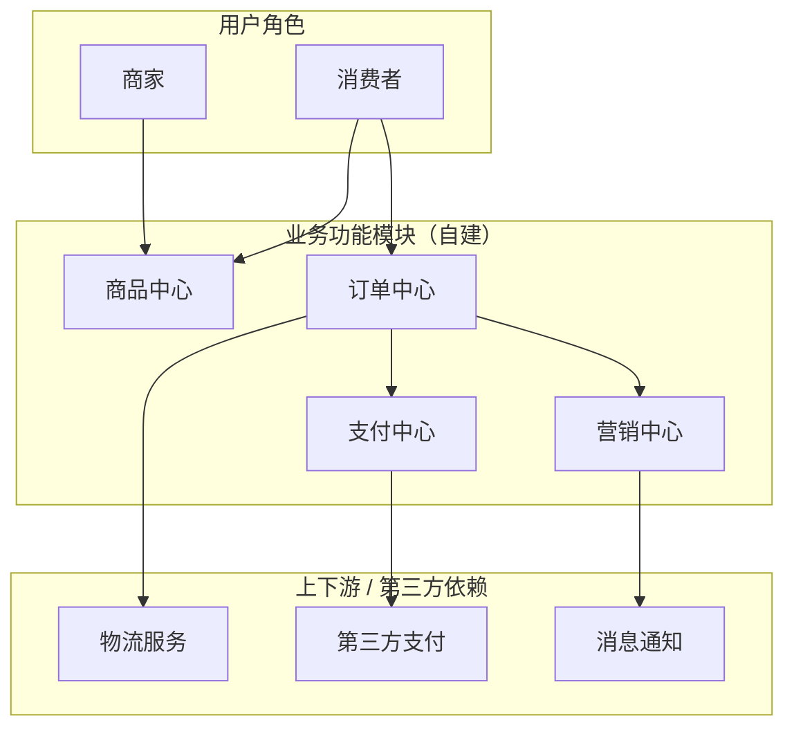
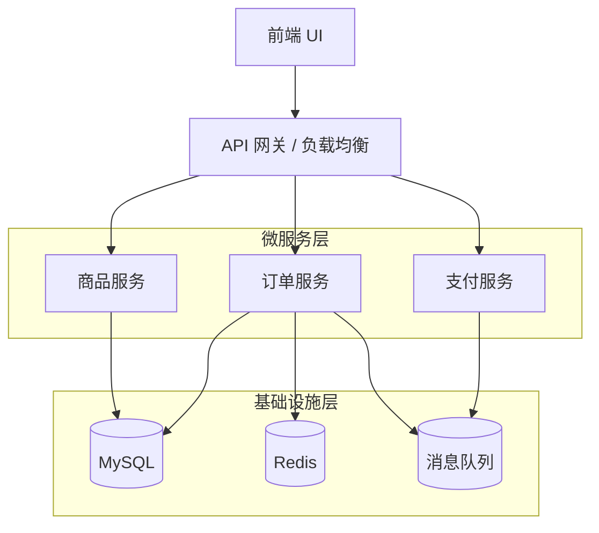
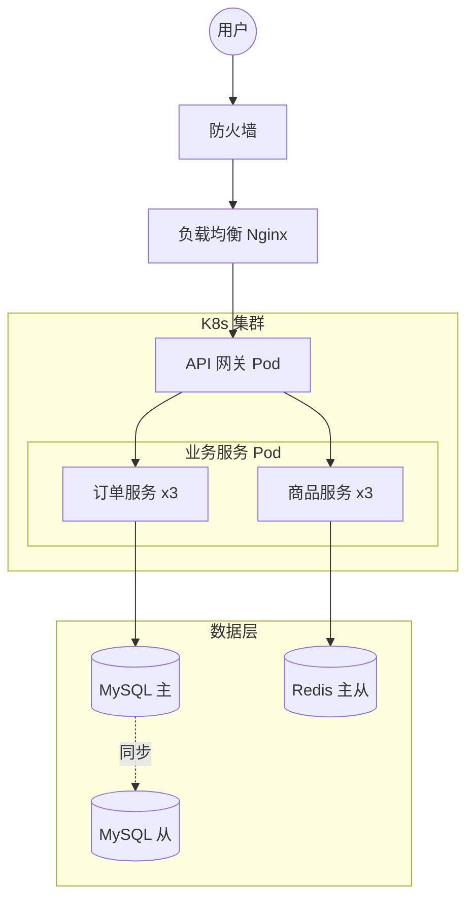
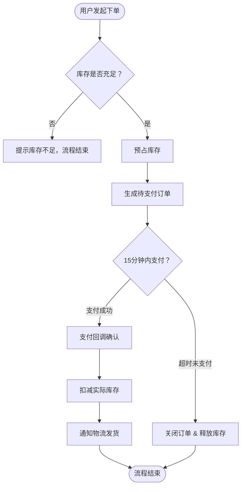
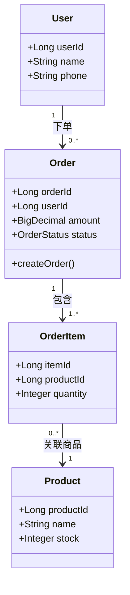
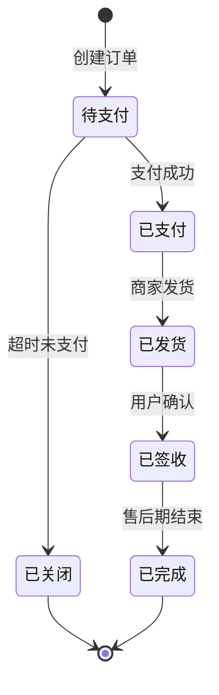
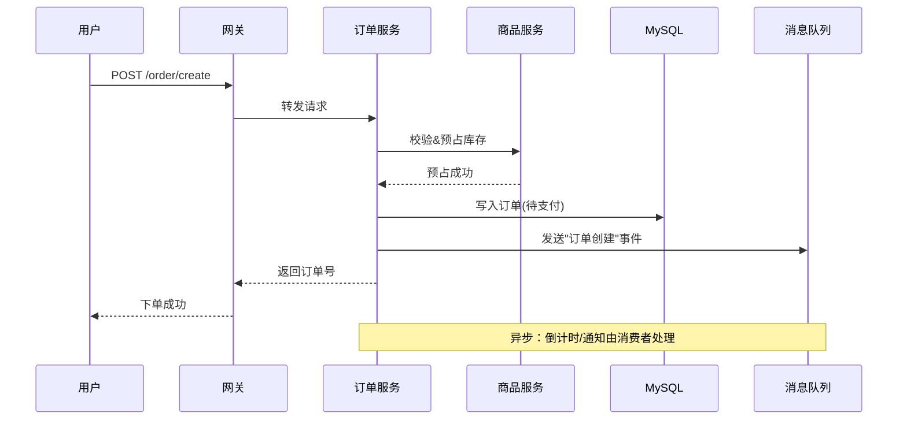
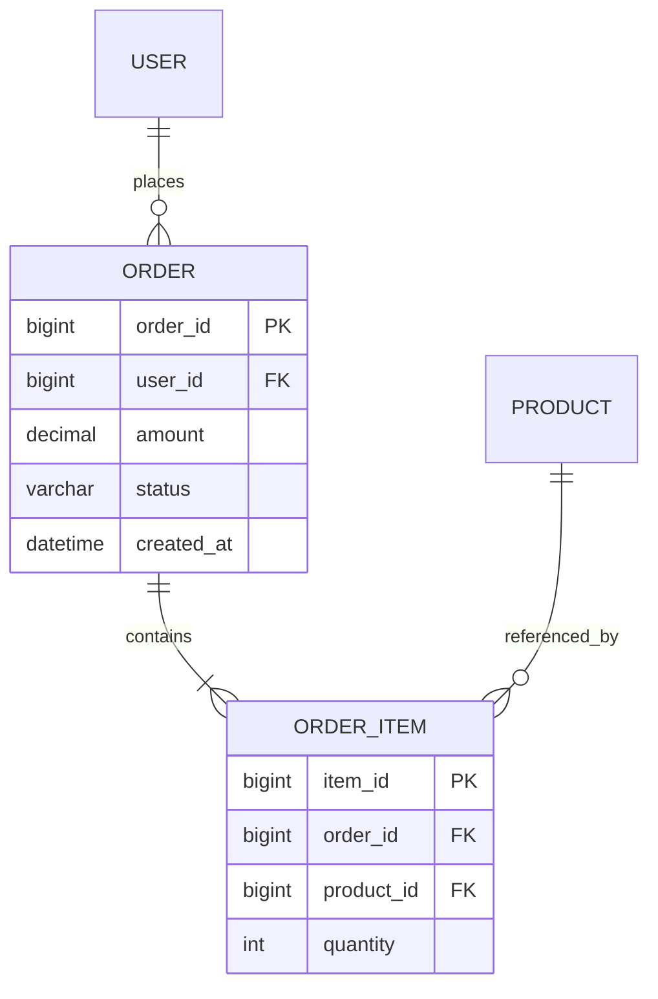

# 如何写好技术方案文档

> 总结业界（阿里、字节等大厂后端岗位）技术方案设计文档的优秀实践，提炼出一套可复用的编写与审核方法论。

## 背景/场景

在团队里，经常出现这样的现象：同样职级的同学，有人写的方案评审一次过，有人改了三五版还被驳回；甚至有些高级别的同学也写不好一份技术方案文档。**究其根本，不是技术能力不够，而是没有形成自己的方法论。**

技术方案文档（Technical Design Document / Design Review）是后端工程师最核心的工程产出之一。它服务于四个目标：

1. **沉淀思考** —— 把模糊的需求转化为清晰的实现路径，逼自己想清楚再动手
2. **达成共识** —— 让评审者（leader、架构师、上下游同学）站在同一个起点上理解你的方案
3. **降低风险** —— 提前暴露异常边界、容量瓶颈、回滚风险，避免线上事故
4. **知识传承** —— 成为后来者理解系统演进的活文档

本文综合业界通用模板（参考阿里、字节、京东等团队实践），总结出"七大原则 + 标准结构 + 审核清单 + 常见反模式"的完整方法论。

---

## 核心内容

### 一、写好技术方案文档的七大原则

| 原则 | 含义 | 为什么重要 |
|------|------|-----------|
| **需求驱动** | 一切设计围绕需求展开，技术为业务服务 | 需求理解偏差，方案再漂亮也是南辕北辙 |
| **结构化思维** | 自上而下，从用户视角逐层下钻到代码 | 让外行能看懂背景，让内行能看懂细节 |
| **方案对比** | 给出多个备选方案，明确折衷（trade-off） | 没有对比就没有决策依据，也体现思考深度 |
| **异常优先** | 异常边界比正常流程更值得花笔墨 | 线上事故 80% 来自异常分支处理不当 |
| **量化评估** | 性能、容量、SLA 都要有数字 | "大概能扛住"不是评估，"峰值 3000 QPS"才是 |
| **可回滚** | 灰度、回滚、容灾是上线前的必答题 | 没有回滚方案的上线都是裸奔 |
| **演进思维** | 架构是逐步演进的，没有完美方案 | 分阶段交付，避免过度设计或一口吃成胖子 |

---

### 二、技术方案文档的标准结构

业界通用做法是"现状 → 需求 → 方案 → 风险"四段式，展开后为八大模块。**根据项目复杂度可裁剪**，但缺一不可的部分（★ 标注）一定要有。

#### 模块 1：现状 / 背景 ★

> 目的：让评审者快速达成共识，站在同一起点。

- **名词释义**：方案涉及的术语、缩略词，解释时不要引入新名词
- **业务背景**：项目名称、业务描述、解决什么问题
- **技术背景**（老系统改造才有）：现有技术积淀、现有架构描述、现有系统整体容量

> 写法要点：假设评审者完全不了解你的项目，用一段话让他看懂"我们在做什么、为什么做"。

#### 模块 2：需求目标 ★

> 目的：明确方案的起点，所有设计都围绕它。

- **业务需求**：要改造什么、要实现什么新功能（从用户角度，不是开发角度）
- **业务痛点**：当前业务面临的具体问题
- **非功能性需求**（非常重要，常被遗漏）★：
  - 性能需求：预估平均/峰值容量、可伸缩性、安全性
  - 可用性需求：SLA 目标（如 99.9%）
  - 系统可观测性需求：监控、日志、链路追踪

> 关键洞察：**非功能性需求是业务方的隐含需求，不会明确告诉你。** 提前考虑这部分，能识别风险，也能让代码更健壮、可扩展。

#### 模块 3：架构设计 ★

> 目的：从抽象到具体，用三张图说清系统全貌。

采用"架构三视图"，从业务视角逐层下钻到物理部署：

| 视图 | 维度 | 回答的问题 |
|------|------|-----------|
| **业务架构** | 业务功能模块 | 系统有哪些功能模块？上下游是谁？依赖哪些第三方/基础服务？ |
| **应用架构** | 微服务 | 由几个微服务组成？数据如何纵向流动（UI→网关→服务→基础设施）？ |
| **部署架构** | 物理结构 | 实际怎么部署？网络、网关、防火墙、存储的真实拓扑？ |

**参考示例（以电商订单系统为例，使用 Mermaid 语法）：**

**① 业务架构图** —— 业务视角的功能模块与上下游：



**② 应用架构图** —— 微服务纵向分层，数据自上而下流动：



**③ 部署架构图** —— 接近真实物理结构，含网络与存储拓扑：



> 写法要点：业务架构用颜色区分自己的模块和依赖模块；三张图的数据流向要保持一致；Mermaid 中用 `subgraph` 分层、用 `[( )]` 表示存储、用 `-. ->` 表示异步/同步等特殊流向。

#### 模块 4：方案详细设计 ★

> 目的：把架构落到可执行的细节。

- **业务全流程**：全局视角的流程图
- **业务实体设计**：核心类及其属性、关系（对应代码抽象，与数据库表无关）
- **任务状态图**：核心实体的状态流转（如订单：待支付→已支付→已发货）
- **核心子流程时序图**：核心场景的服务间交互（详略得当，能直接对着开发）
- **存储设计**：ER 关系图、数据库表结构
- **接口设计**：贴 yapi 文档或自定接口，粒度到入参、出参

**参考示例（电商订单系统，Mermaid 语法）：**

**① 业务全流程图**（全局视角的下单全流程，用 flowchart）：


**② 业务实体设计**（核心领域类及关系，用 classDiagram）：


**③ 任务状态图**（订单状态流转，用 stateDiagram-v2）：


**④ 核心子流程时序图**（创建订单的服务间交互，用 sequenceDiagram）：


**⑤ 存储设计 ER 图**（表级关系，用 erDiagram）：


> 写法要点：流程图聚焦核心路径与关键分支判断（是/否）；时序图要标注同步调用（实线）与异步消息（Note）；ER 图只画表级关系与关键字段，避免冗长列清单。

#### 模块 5：方案对比（可选但强烈推荐）

> 目的：体现思考深度，为决策提供依据。

- 列出 2~3 个备选方案
- 每个方案给出：概述（一句话亮点）、详细说明、性能目标、优缺点（**最好量化**）
- **方案对比表**：从性能、成本、复杂度、可维护性等维度横向对比
- **明确决策**：你倾向哪个方案？为什么？

> 关键：如果没有方案对比，至少要说明"为什么选这个方案"。设计折衷（trade-off）必须写清楚——这是评审者最关注的点。

#### 模块 6：高可用设计 ★

> 目的：保障系统在线上的稳定性。

- **模块高可用**：
  - 接入层：多节点部署
  - 服务间调用：超时控制、重试机制、熔断降级
  - 公共组件：配置热更新
  - 基础设施：MySQL 主从、Redis 主从、定时快照
- **第三方依赖**：列出依赖的第三方接口、依赖类型（强/弱）、降级熔断措施
  - 防止被第三方异常拖垮

> 关键洞察：**强依赖的第三方出问题，要有明确的降级策略**（如快速失败、返回兜底数据）。

#### 模块 7：异常边界 ★（重中之重）

> 目的：覆盖所有"可能出错的地方"。

线上事故大部分来自异常情况。推荐用 xmind 整理异常边界：

- 涉及哪些模块、哪些流程？
- 每个模块/流程出现各种异常时的处理策略？
- 系统底层原因（如网络抖动、磁盘满、下游超时）导致的异常如何处理？

> 经验：写完正常流程后，专门花时间做一次"异常边界头脑风暴"，这是区分普通方案和优秀方案的分水岭。

#### 模块 8：性能与容量评估 ★

> 目的：用数字证明方案能扛住业务量。

**容量评估公式（业界通用）：**

```
日平均请求量：来自产品评估
平均 QPS = 日平均请求量 ÷ 40000 秒
  （86400 秒按活跃时间折半 ≈ 40000 秒）
峰值 QPS = 平均 QPS × (2~4 倍)
```

- **性能评估**：单机并发量、单机容量、按预估需求算出资源数量（应用服务器、缓存、存储、队列）
- **伸缩方式**：如何横向扩展
- **资源预估表**：实例 pod、MySQL、Redis 的规格和数量

#### 模块 9：风险、回滚与规划 ★

> 目的：上线前的安全网 + 长期演进方向。

- **灰度策略**：如何分批放量
- **回滚方案**：上线失败怎么回滚（数据回滚、代码回滚、配置回滚）
- **容灾方案**：IDC 异常如何容灾
- **风险评估**：改动有哪些风险点、不兼容点、当前方案的遗留问题
- **阶段规划**：架构如何演进，每个阶段达成什么目标
- **工作量评估**：细化到每个模块/接口的开发、联调、测试时间

---

### 三、关键技巧

#### 1. 架构图怎么画才专业

- **分层清晰**：业务架构 > 应用架构 > 部署架构，自上而下
- **颜色语义化**：自己的模块一个色，依赖的第三方一个色，基础服务一个色
- **数据流向一致**：三张图的流向不要矛盾
- **避免过度细节**：架构图讲结构，时序图讲细节，不要混在一起

#### 2. 性能评估的常见指标

| 指标 | 说明 | 评估方法 |
|------|------|----------|
| QPS | 每秒查询数 | 日请求量 ÷ 40000 |
| 峰值 QPS | 峰值每秒查询数 | 平均 QPS × 2~4 |
| RT | 响应时间 | 压测得出 |
| SLA | 可用性 | 如 99.9% = 年宕机 < 8.76h |
| 资源数 | 服务器/存储数量 | 峰值 QPS ÷ 单机 QPS + 冗余 |

#### 3. 异常边界的 xmind 整理法

```
异常边界
├── 模块A（如：订单服务）
│   ├── 流程：创建订单
│   │   ├── 库存扣减失败 → 回滚，返回库存不足
│   │   ├── 支付超时 → 关单，释放库存
│   │   └── 重复请求 → 幂等校验
│   └── 底层异常
│       ├── DB 连接超时 → 重试 3 次后降级
│       └── Redis 不可用 → 限流 + 兜底
└── 模块B...
```

---

### 四、审核 Checklist（评审者视角）

写完方案后，用这份清单自检一遍。一份合格的方案文档应该能回答以下所有问题：

**背景与需求**
- [ ] 外行能看懂项目背景和要解决的问题吗？
- [ ] 名词释义是否完整，没有引入未解释的新名词？
- [ ] 需求是否覆盖了非功能性需求（性能、可用性、可观测性）？

**架构与设计**
- [ ] 是否有业务架构、应用架构、部署架构三张图？
- [ ] 架构图数据流向是否一致、颜色是否语义化？
- [ ] 核心流程是否有时序图，能直接对着开发？
- [ ] 存储设计是否有 ER 图和表结构？
- [ ] 接口设计是否到入参/出参粒度？

**方案深度**
- [ ] 是否有方案对比？是否量化了优缺点？
- [ ] 是否明确了设计折衷（trade-off）和选择理由？
- [ ] 关键设计点的思路是否表述清楚？

**稳定性保障**
- [ ] 异常边界是否系统化梳理（而非零散提及）？
- [ ] 第三方依赖是否列出并标明强/弱依赖及降级策略？
- [ ] 高可用设计是否覆盖接入层、服务层、基础设施层？

**可上线性**
- [ ] 性能与容量是否有量化评估（QPS、资源数）？
- [ ] 是否有灰度策略和回滚方案？
- [ ] 是否有风险评估和遗留问题说明？
- [ ] 工作量是否细化到模块/接口，含开发+联调+测试时间？

---

### 五、常见反模式（要避免的错误）

| 反模式 | 问题 | 正确做法 |
|--------|------|----------|
| **需求理解不清就设计** | 方案偏离业务目标 | 先把需求（含非功能性）写清楚，再设计 |
| **直接给结论不对比** | 体现不出思考深度，决策无依据 | 给 2~3 个方案，量化对比，说明折衷 |
| **只写正常流程** | 异常上线就出事故 | 专门梳理异常边界，用 xmind 列全 |
| **性能用"大概能扛"** | 无法评估资源，埋下容量隐患 | 用 QPS 公式量化，给出资源数 |
| **没有回滚方案** | 上线失败只能干等 | 明确灰度策略和回滚步骤 |
| **架构图混成一团** | 评审者看不懂结构 | 三视图分层，颜色语义化 |
| **大而全一口吃成胖子** | 周期长、风险高 | 分阶段演进，每阶段可交付 |
| **照搬模板不裁剪** | 新系统写"现有容量"等无意义章节 | 按项目实际情况增删模块 |

---

## 实践案例

### 案例 1：秒杀活动技术方案

**场景描述：** 某电商要做限时秒杀，预估峰值 10w QPS。

**关键设计点：**
- 需求：明确峰值 QPS（非功能性需求），这是设计的起点
- 架构：接入层限流（令牌桶）→ 缓存预热 → 异步下单（MQ 削峰）→ DB
- 异常边界：超卖（Redis 原子扣减）、重复下单（幂等）、缓存击穿（布隆过滤器/空值缓存）、MQ 堆积（消费者扩容）
- 回滚：活动商品可一键下架， MQ 可切换消费组
- 容量评估：峰值 10w QPS → 按 Redis 单机 10w QPS、应用单机 5000 QPS 算资源数

**结果反思：** 秒杀方案的成败 80% 取决于异常边界和容量评估，而不是正常下单流程。

### 案例 2：老系统重构方案

**场景描述：** 将单体应用拆分为微服务。

**关键设计点：**
- 现状：必须写清现有架构和容量（这是老系统特有的）
- 方案对比：直接重写 vs 渐进式拆分（选后者，风险可控）
- 折衷：渐进式拆分需要双写、数据迁移，短期复杂度上升，换取长期可维护性
- 阶段规划：先拆非核心服务试点，验证后再拆核心链路
- 回滚：每个服务独立部署，可单独回滚

**结果反思：** 重构方案最重要的是"阶段规划"和"灰度回滚"，切忌一步到位。

---

## 参考资料

- [我终于统一了团队的技术方案设计模板](https://blog.51cto.com/u_15909947/5932075) - 后端系统和架构（精简版+详细版模板）
- [后端方案设计文档结构模板可参考](https://blog.csdn.net/qq_42647903/article/details/138352011) - 结构化思维、架构三视图
- 《分布式服务架构：原理、设计与实战》第 3 章 - 系统容量评估与性能保障
- [后端 API 设计与文档编写全流程最佳实践](https://developer.aliyun.com/article/1637945) - 阿里云开发者社区

---

## 总结反思

### 关键收获

- **方法论比模板更重要**：模板可以裁剪，但"需求驱动、结构化思维、异常优先、量化评估"的原则不能丢
- **异常边界是分水岭**：普通方案和优秀方案的核心差距，在于对异常的处理深度
- **量化是底线**：没有数字的方案是"作文"，有 QPS、资源数、SLA 的才是"工程文档"
- **可回滚是上线前提**：任何方案都必须回答"失败了怎么办"

### 待改进

- 不同规模团队对方案粒度要求不同，可进一步细化"轻量版 / 标准版 / 重量版"三档模板
- 可补充前端、数据、算法等不同岗位的技术方案差异点
- 可积累更多真实评审案例作为反面教材

---

*更新日期：2026-06-28*
